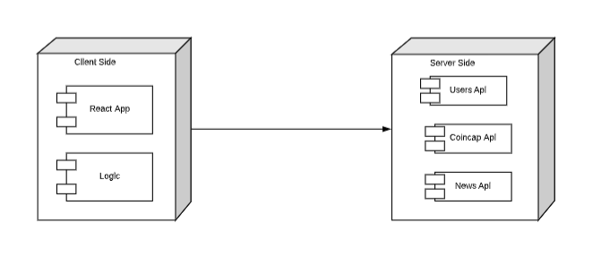

# Crypto-State

CryptoState is a simple page to learn about crypto currencies and start to understand some of the fundamental concepts and follow the state and news of your cryptos that interest you.

## Functional Description

The main features that this application allows a #

user

login and register

Search cryptocurrency

Add to Favorites.

Aee diagram of the cryptocurrency

See news of the cryptocurrency

## Use Cases

### Workflow

### Blocks

### Moduls

### Testing

