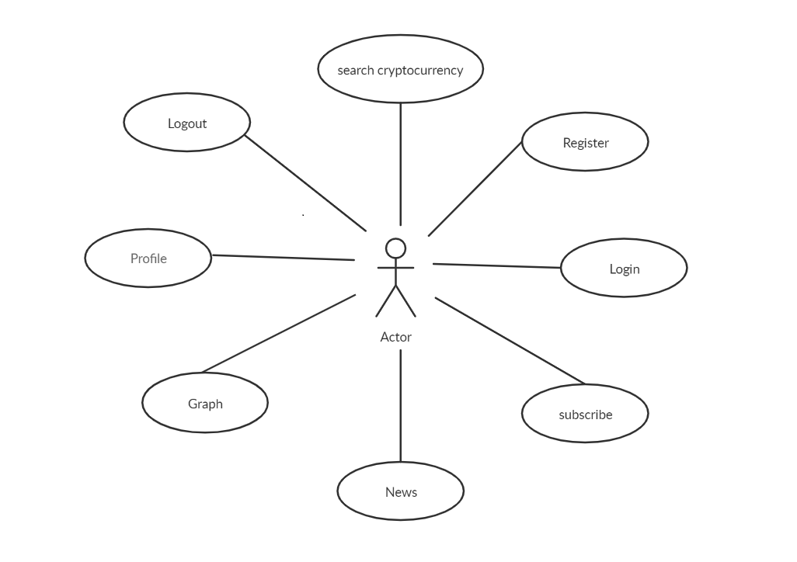

# Crypto-State

CryptoState is a simple page to learn about crypto currencies and start to understand some of the fundamental concepts and follow the state and news of your cryptos that interest you.

## Functional Description

The main features that this application allows a user

1 User can do:

- login and register.

- Search cryptocurrency.

- Subscribe.

- Edit profile.

- Aee diagram of the cryptocurrency.

- See news of the cryptocurrency.

## Use Cases

### Workflow

### Blocks

### Moduls

### Testing

